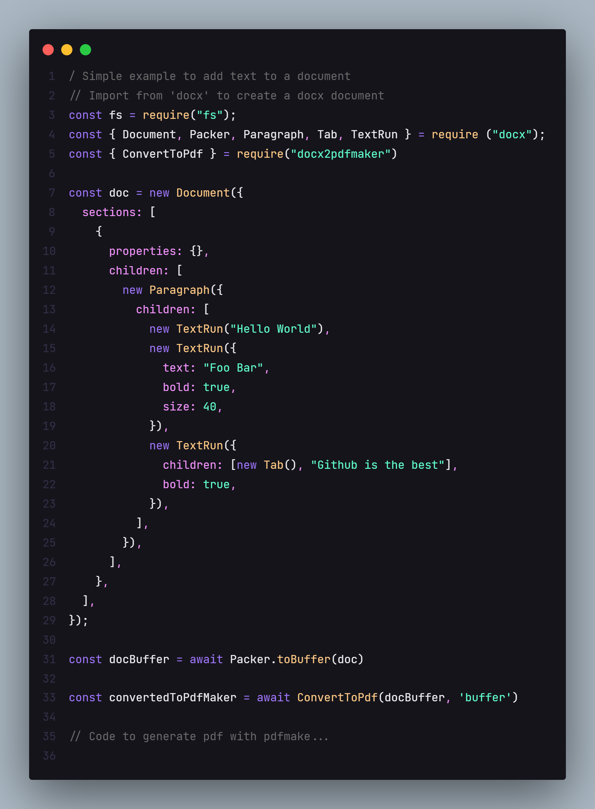

<h1 align="center">
  <b>
     
  </b>
</h1>

Easier way to convert .docx file into Pdfmaker libary format

  <a href="https://github.com/Igorcbraz/Docx2PdfMaker"><b>Website</b></a> •
  <a href="https://github.com/Igorcbraz/Docx2PdfMaker"><b>Documentation</b></a>

   

# Reference

<b>ConvertToPdf</b>

| Parameter | Type | Description |
| :--- | :--- | :--- |
| `data` | `string` | **Required**. The data corresponding to the type used |
| `type` | `path, buffer or ArrayBuffer` | **Required**. Type of sending data |
| `options` | `ConvertToHtml Config` | ConvertoToHtml mammoth library options  |

<a href="https://www.npmjs.com/package/mammoth?activeTab=readme"><b>ConvertToHtml Config</b></a>

# Examples

Check the [demo folder](https://github.com/Igorcbraz/Docx2PdfMaker/tree/main/example) for examples.